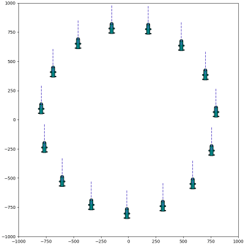

# SwarmRobotics

The project is a Swarm Robotics simulation platform implemented using Python and Matplotlib.It allows users to create custom Swarm Robotics algorithms and test and evaluate them in a simulated environment.The English version is machine translation, the Chinese version of the readme is more readable, it is recommended to refer to the Chinese version.Translate script as:

```bash
python translate_readme.py
```

[English](./README.md)|[中文](./readme_chinese.md)

## 1. Configure

To install the project, you need to perform the following steps:

*   Clone this item:

```bash
git clone https://github.com/xzlxiao/SwarmRobotics.git
``` - Installation Dependencies:

```bash
pip install -r requirements.txt
```

*   Enter the project directory:

```bash
cd SwarmRobotics
```

## 2. How to use

To run the Swarm Robotics simulation platform, you can execute the following command:- 3D path planning (potential field path planning algorithm)

```bash
python Example/exm_路径规划-3D.py
```

Replace Python with your compiler version.In this script, you can modify various parameters of the algorithm.


*   2D Path Planning 1


*   2D Path Planning 2


*   3D Path Following


*   2D Path Following



*   multi-objective search algorithm


*   Subgroup dynamic segmentation algorithm


*   AFSA multi-robot target search, perception limited


## 3. Example: 

*   Here's a simple example that uses a random walk algorithm to simulate a Swarm Robotics system:

```python
from swarm import Swarm
from algorithms import RandomWalk
swarm = Swarm(algorithm=RandomWalk)
swarm.run()
swarm.animate()
```

## 4. Author

*   Xiao Zhenlong(肖镇龙)

## 5. Contribution

Contributors:

*   Contributor Name
*   If you want to contribute to the project, see contributing

[CONTRIBUTING.md]()

## 6. Permits

It is licensed under the GPL (GNU General Public License). For more information, see license.

[LICENSE](./LICENSE)